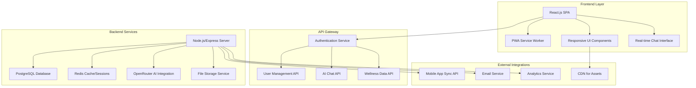

# SeaSmart Website Design Document

## Overview

The SeaSmart website will be a comprehensive mental health platform that serves as both a marketing portal and a fully functional web companion to the mobile application. The design emphasizes accessibility, user experience, and seamless integration with the existing mobile app ecosystem while providing unique web-specific capabilities.

## Architecture

### System Architecture



### Technology Stack

#### Frontend
- **Framework**: React.js 18+ with TypeScript
- **State Management**: Redux Toolkit or Zustand
- **Styling**: Tailwind CSS with custom SeaSmart theme
- **UI Components**: Headless UI or Radix UI for accessibility
- **Charts**: Chart.js or D3.js for mood analytics
- **Real-time**: Socket.io client for live chat
- **PWA**: Workbox for offline functionality

#### Backend
- **Runtime**: Node.js with Express.js
- **Database**: PostgreSQL 15+ with Prisma ORM
- **Cache**: Redis for sessions and real-time data
- **Authentication**: JWT with refresh tokens
- **File Upload**: Multer with AWS S3 integration
- **Real-time**: Socket.io server
- **API Documentation**: OpenAPI/Swagger

#### Infrastructure
- **Hosting**: Vercel (frontend) + Railway/Render (backend)
- **Database**: Supabase or PlanetScale
- **CDN**: Cloudflare for global asset delivery
- **Monitoring**: Sentry for error tracking
- **Analytics**: Plausible or Google Analytics 4

## Components and Interfaces

### 1. Landing Page Components

#### Hero Section
```typescript
interface HeroSectionProps {
  title: string;
  subtitle: string;
  ctaButtons: {
    primary: { text: string; action: string };
    secondary: { text: string; action: string };
  };
  backgroundVideo?: string;
  aiAvatarDemo: boolean;
}
```

#### Feature Showcase
```typescript
interface FeatureCardProps {
  icon: React.ComponentType;
  title: string;
  description: string;
  screenshot: string;
  demoVideo?: string;
  benefits: string[];
}
```

#### Testimonials
```typescript
interface TestimonialProps {
  user: {
    name: string;
    avatar: string;
    role: string;
  };
  content: string;
  rating: number;
  verified: boolean;
}
```

### 2. Authentication Components

#### Login/Register Form
```typescript
interface AuthFormProps {
  mode: 'login' | 'register' | 'recovery';
  onSubmit: (data: AuthData) => Promise<void>;
  socialProviders: ('google' | 'facebook')[];
  emailValidation: {
    allowedDomains: string[];
    customValidation?: (email: string) => boolean;
  };
}

interface AuthData {
  email: string;
  password: string;
  confirmPassword?: string;
  fullName?: string;
  phone?: string;
  acceptTerms?: boolean;
}
```

### 3. Dashboard Components

#### Wellness Dashboard
```typescript
interface DashboardProps {
  user: UserProfile;
  moodData: MoodAnalytics;
  recentActivities: Activity[];
  aiInsights: AIInsight[];
  quickActions: QuickAction[];
}

interface MoodAnalytics {
  currentLevel: number;
  weeklyTrend: MoodDataPoint[];
  monthlyAverage: number;
  improvementMetrics: {
    streakDays: number;
    totalSessions: number;
    favoriteActivities: string[];
  };
}
```

#### Activity Cards
```typescript
interface ActivityCardProps {
  type: 'breathing' | 'chat' | 'journal' | 'game';
  title: string;
  description: string;
  duration?: number;
  difficulty?: 'easy' | 'medium' | 'hard';
  completionStatus: 'not_started' | 'in_progress' | 'completed';
  onStart: () => void;
}
```

### 4. AI Chat Interface

#### Chat Container
```typescript
interface ChatInterfaceProps {
  aiAvatar: {
    name: string;
    image: string;
    personality: string;
  };
  chatHistory: ChatMessage[];
  isTyping: boolean;
  voiceEnabled: boolean;
  onSendMessage: (message: string) => void;
  onVoiceInput: () => void;
}

interface ChatMessage {
  id: string;
  sender: 'user' | 'ai';
  content: string;
  timestamp: Date;
  type: 'text' | 'voice' | 'suggestion';
  metadata?: {
    moodDetected?: string;
    crisisLevel?: number;
    suggestedActions?: string[];
  };
}
```

### 5. Wellness Activity Components

#### Breathing Exercise
```typescript
interface BreathingExerciseProps {
  type: 'box' | 'alternate_nostril' | 'belly';
  duration: number;
  guidance: {
    inhale: number;
    hold: number;
    exhale: number;
    pause: number;
  };
  visualAnimation: 'circle' | 'wave' | 'flower';
  audioEnabled: boolean;
}
```

#### Journal Editor
```typescript
interface JournalEditorProps {
  entry?: JournalEntry;
  onSave: (entry: JournalEntry) => Promise<void>;
  moodSelector: boolean;
  privacyLevel: 'private' | 'therapist' | 'anonymous';
  templates: JournalTemplate[];
}

interface JournalEntry {
  id?: string;
  title: string;
  content: string;
  mood: number;
  tags: string[];
  createdAt: Date;
  updatedAt: Date;
  attachments?: File[];
}
```

## Data Models

### User Profile
```typescript
interface UserProfile {
  id: string;
  email: string;
  fullName: string;
  avatar?: string;
  preferences: {
    aiAvatar: 'saira' | 'kael';
    notifications: NotificationSettings;
    privacy: PrivacySettings;
    accessibility: AccessibilitySettings;
  };
  profile: {
    age?: number;
    gender?: string;
    location?: string;
    emergencyContact?: string;
    mentalHealthGoals: string[];
  };
  subscription: {
    plan: 'free' | 'premium';
    expiresAt?: Date;
    features: string[];
  };
  createdAt: Date;
  lastLoginAt: Date;
}
```

### Wellness Data
```typescript
interface WellnessData {
  userId: string;
  moodEntries: MoodEntry[];
  activities: ActivityLog[];
  journalEntries: JournalEntry[];
  chatSessions: ChatSession[];
  achievements: Achievement[];
  streaks: StreakData;
}

interface MoodEntry {
  id: string;
  level: number; // 1-6 scale
  notes?: string;
  triggers?: string[];
  timestamp: Date;
  source: 'daily_checkin' | 'journal' | 'chat';
}

interface ActivityLog {
  id: string;
  type: 'breathing' | 'game' | 'meditation' | 'exercise';
  name: string;
  duration: number;
  completedAt: Date;
  effectiveness?: number; // user rating 1-5
  notes?: string;
}
```

### AI Conversation
```typescript
interface ChatSession {
  id: string;
  userId: string;
  aiAvatar: string;
  messages: ChatMessage[];
  startedAt: Date;
  endedAt?: Date;
  summary?: {
    moodDetected: string;
    topicsDiscussed: string[];
    recommendedActions: string[];
    crisisIndicators: boolean;
  };
}
```

## Error Handling

### Error Types
```typescript
enum ErrorType {
  AUTHENTICATION = 'auth_error',
  VALIDATION = 'validation_error',
  NETWORK = 'network_error',
  AI_SERVICE = 'ai_service_error',
  DATABASE = 'database_error',
  PERMISSION = 'permission_error'
}

interface AppError {
  type: ErrorType;
  message: string;
  code: string;
  details?: any;
  timestamp: Date;
  userId?: string;
}
```

### Error Handling Strategy
1. **Client-side validation** with immediate feedback
2. **Graceful degradation** for offline scenarios
3. **User-friendly error messages** avoiding technical jargon
4. **Automatic retry logic** for transient failures
5. **Error reporting** to monitoring service
6. **Crisis situation handling** with immediate support resources

### Crisis Detection Protocol
```typescript
interface CrisisDetection {
  keywords: string[];
  sentimentThreshold: number;
  escalationProcedure: {
    immediate: string[]; // Crisis hotlines
    followUp: string[]; // Professional resources
    notification: boolean; // Alert emergency contact
  };
}
```

## Testing Strategy

### Testing Pyramid

#### Unit Tests (70%)
- Component rendering and props
- Utility functions and helpers
- API service methods
- Data transformation logic
- Validation functions

#### Integration Tests (20%)
- API endpoint testing
- Database operations
- Authentication flows
- Real-time chat functionality
- File upload/download

#### End-to-End Tests (10%)
- Complete user journeys
- Cross-browser compatibility
- Mobile responsiveness
- Accessibility compliance
- Performance benchmarks

### Testing Tools
- **Unit**: Jest + React Testing Library
- **Integration**: Supertest + Test Containers
- **E2E**: Playwright or Cypress
- **Accessibility**: axe-core + Pa11y
- **Performance**: Lighthouse CI
- **Visual**: Chromatic or Percy

### Test Scenarios

#### Critical User Flows
1. **User Registration & Onboarding**
   - Email validation with domain checking
   - Profile setup completion
   - Avatar selection sync with mobile

2. **AI Chat Interaction**
   - Message sending and receiving
   - Voice input/output functionality
   - Crisis detection and response
   - Chat history persistence

3. **Wellness Activity Completion**
   - Breathing exercise guidance
   - Journal entry creation and editing
   - Mood tracking and analytics
   - Progress synchronization

4. **Cross-Platform Sync**
   - Data consistency between web and mobile
   - Real-time updates across devices
   - Offline functionality and sync

### Performance Requirements
- **First Contentful Paint**: < 1.5s
- **Largest Contentful Paint**: < 2.5s
- **Cumulative Layout Shift**: < 0.1
- **First Input Delay**: < 100ms
- **Time to Interactive**: < 3s

### Accessibility Standards
- **WCAG 2.1 AA compliance**
- **Keyboard navigation support**
- **Screen reader compatibility**
- **Color contrast ratios** (4.5:1 minimum)
- **Focus management** for dynamic content
- **Alternative text** for all images and media

## Security Considerations

### Data Protection
- **Encryption at rest** using AES-256
- **Encryption in transit** using TLS 1.3
- **End-to-end encryption** for sensitive chat data
- **Data anonymization** for analytics
- **Regular security audits** and penetration testing

### Authentication Security
- **JWT tokens** with short expiration (15 minutes)
- **Refresh token rotation** for session management
- **Multi-factor authentication** option
- **Rate limiting** on authentication endpoints
- **Account lockout** after failed attempts

### Privacy Compliance
- **GDPR compliance** with data portability
- **HIPAA considerations** for health data
- **Cookie consent** management
- **Data retention policies** with automatic cleanup
- **User consent tracking** for data usage

This design document provides a comprehensive foundation for building the SeaSmart website that seamlessly integrates with the mobile application while offering unique web-specific features and maintaining the highest standards of user experience, security, and accessibility.